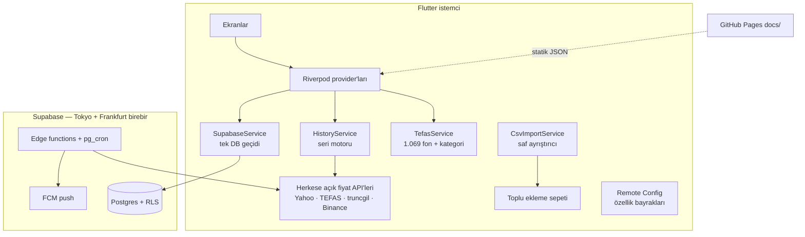

# Büyüme Özellikleri — Teknik Fizibilite ve Uygulama Planı (2026-09-29)

**Kaynak:** ASO / bağlılık / yatırımcı araştırması (aynı gün, sohbet). Bu belge
o önerilerin **kod tabanına karşı** fizibilitesini ve uygulama sırasını verir.
**Değişmez kural:** hiçbir eklenti mevcut işlevi bozmaz (§2).

**Durum:** ÖNERİ — kullanıcı onayı bekliyor. Onaylanan kararlar
`manage_adr`'ye (codebase-memory-mcp) işlenir; önce `index_repository`, sonra
ADR (bkz. bellek: indeksleme ADR'yi siler).

---

## 0. Özet tablo

| # | Özellik | Fizibilite | Veri kaynağı | Sunucu değişikliği | Mevcut işleve risk | Efor |
|---|---|---|---|---|---|---|
| F1 | Örnek portföyle dene (kayıtsız) | ✅ Yüksek | Uygulamaya gömülü demo | **Yok** | Düşük (izole kabuk) | 5–7 gün |
| F2 | İlk açılış sırası + seviye sorusu | ✅ Yüksek | — | Yok | Düşük-orta (kapı sırası) | 1–2 gün |
| F3 | Anlaşılırlık düzeltmeleri (işaret, "puan") | ✅ Yüksek | — | Yok | Çok düşük | 0,5–1 gün |
| F4 | Fon karnesi | ✅ Yüksek | TEFAS (zaten çekiliyor) | Yok | Çok düşük (ek alan) | 2–3 gün |
| F5 | Temettü yakalama + 12 ay temettü geliri | ✅ Yüksek | Yahoo `events=div` (doğrulandı) | Tablo + cron (ek) | Düşük | 4–6 gün |
| F6 | Halka arz takvimi + katılım kaydı | ✅ Orta-yüksek | Elle derlenmiş JSON (GitHub Pages) | Yok | Çok düşük | 3–4 gün |
| F7 | Aracı kurum ekstresi içe aktarma | ⚠️ Orta | Kullanıcının kopyaladığı tablo | Yok | Düşük (ayrıştırıcı önüne adaptör) | 1–2 gün / kurum |
| F8 | KAP bildirimleri | ⛔ Sözleşmeye bağlı | KAP Veri Yayın Servisi | Edge function + cron | Düşük | 5–7 gün + sözleşme |
| F9 | Yıl sonu özeti (canlıya hazırlık) | ✅ Yüksek | Var (`recap_service`) | calendar-nudge'a an | Çok düşük | 1–2 gün |
| F10 | Kilit ekranı widget'ı (iOS) | ✅ Yüksek | Var (widget sözleşmesi) | Yok | Düşük (ek aile) | 2 gün |
| F11 | Etkinleşme hunisi ölçümü | ✅ Yüksek | Firebase (var) | Yok | Yok | 1 gün |

Toplam (F8 hariç): ~22–31 geliştirme günü. F8 sözleşme süresine bağlı.

---

## 1. Mimari bağlam (keşif bulguları)



Fizibiliteyi belirleyen ölçülmüş gerçekler:

- **`HistoryService` Supabase kullanmıyor.** Grafikler ve seriler herkese açık
  fiyat API'lerinden istemcide hesaplanıyor. Veritabanına hiç dokunmayan bir
  demo mümkün (F1).
- **Anonim oturum kapalı** (`supabase/config.toml` `enable_anonymous_sign_ins =
  false`). Açmak, `authenticated` rolüne bağlı her RLS kuralına ve kullanıcılar
  üzerinde dolaşan cron'lara (günlük/haftalık özet, yarış snapshot, Zirve havuzu)
  anonim kullanıcıları da sokar (F1 ADR-1).
- **TEFAS listesi** (`fonGetiriBazliBilgiGetir`) 1.069 fonu
  `fonTurAciklama` (kategori), 1a/3a/6a/1y/yb/3y/5y getiri ve `riskDegeri` ile
  veriyor (canlı istekle doğrulandı). `TefasFund` modeli kategoriyi okumuyor;
  eklemek ek bir alan (F4).
- **Yahoo chart `events=div`** BIST hisselerinin **geçmiş** temettü tarihini
  ve tutarını veriyor (THYAO, TUPRS, EREGL ile doğrulandı). **İlan edilmiş ama
  henüz ödenmemiş** temettüyü vermiyor; onun kaynağı KAP (F5, F8).
- **`CsvImportService`** saf ayrıştırıcı. "Yapıştır → önizle → sepet → toplu
  kayıt" hattı hazır. Kurum biçimi bu hattın ÖNÜNE takılan bir adaptör olur (F7).
- **`calendar-nudge`** ulusal dikkat anlarına bağlı push üretiyor (TÜFE
  günü); yıl sonu özeti bu desene yeni bir "an" olarak eklenir (F9).
- **Etkinleşme olayları kısmen var:** `first_asset`, `three_assets`,
  `push_granted`, `widget_used`, `first_week_survived`. Kayıt hunisinin
  adımları yok (F11).
- **Widget:** iOS'ta `systemSmall/Medium/Large` var; kilit ekranı aileleri
  (`accessory*`) yok (F10).
- **Özellik bayrağı altyapısı var** (`RemoteConfigService`, 20+ bayrak).

---

## 2. Bozmama güvenceleri (her özellik için zorunlu)

1. **Bayrak arkasında gelir.** Her özelliğin Remote Config bayrağı olur,
   **varsayılan `false`**. Kod mağazaya kapalı gider, TestFlight'ta açılır,
   sonra kademeli açılır. Sorun çıkarsa yayın gerekmeden kapanır.
2. **Yalnızca ekleme yapan şema.** Yeni tablo, yeni sütun (varsayılanlı),
   yeni RPC. Var olan RPC imzası, `returns table` sütunu ve RLS kuralı
   **değişmez** (bkz. bellek: PG dönüş tipi tuzağı, `drop function` GRANT
   götürür). Her migration iki sunucuya birlikte gider, sonunda
   `sema_esitlik.py` çalışır.
3. **Yeni kod yeni dosyada.** Var olan dosyaya yalnızca giriş noktası (bir
   satır, bir düğme) eklenir. Mevcut hesap fonksiyonlarının (`PortfolioState`,
   `aggregatePositions`, `HistoryService`, `fiyat_kaynagi`) davranışı değişmez;
   gerekiyorsa yanlarına yeni fonksiyon yazılır.
4. **Değişmez testleri kırılmaz, azalmaz:** `design_token_leak`,
   `spacing_scale`, `fiyat_kaynagi_sozlesmesi`, `l10n_coverage`,
   `reduce_motion_coverage`, `grafik_eksen_etiketi`, `metin_hiyerarsisi`.
   Her özellik kendi testiyle gelir. Tam paket + `integration.yml` +
   emülatör dağıtımı her fazın sonunda.
5. **Fiyat kaynağı sözleşmesi korunur:** yeni yüzey sembol merdiveni kurmaz,
   uydurma sayı üretmez (temettü tutarı, stopaj oranı dahil; bkz. F5).
6. **Veri yazan her yeni yol RLS + GRANT ile, sunucuda `raise exception`
   doğrulamasıyla** (0036/0042/0043 deseni). Cron'lar `requireCronSecret()`
   ile kapalı-başarısız (fail-closed).
7. **Tur/sürüm notu kuralı:** ana yüzeye dokunan her özellik aynı değişiklikte
   tur adımı + sürüm notu + `TourAnchor` alır.

---

## 3. Özellik tasarımları

### F1 — Örnek portföyle dene (kayıtsız)

**Amaç:** Kullanıcı hesap açmadan önce uygulamanın değerini görsün. Bugün
değere ulaşmadan önce 6 kapı var ve kullanıcı başına ortanca kayıt sayısı 2.

**ADR-1 (önerilen): Demo sunucuya dokunmaz, istemcide ve bellekte çalışır.**

| Seçenek | Artı | Eksi |
|---|---|---|
| **A. Yerel demo (seçilen)** — ayrı `DemoKabugu`, iç içe `ProviderScope` ile provider override | Sunucu, RLS, cron, yarış havuzu hiç etkilenmez; demo verisi kullanıcı hesabına sızamaz | Ekranlar "yazma" anında demo olduğunu bilmeli; override listesi bakım ister |
| B. Supabase anonim oturum + hesaba bağlama | Demo verisi gerçek hesaba dönüşür | Tüm RLS/cron/havuz sorgularına `is_anonymous` filtresi gerekir (2 sunucu, ~10 fonksiyon), veritabanında anonim çöp birikir, Zirve/yarış havuzunu kirletme riski |

**Tasarım:**

- Giriş ekranında ikincil düğme: "Önce bir göz at". `DemoKabugu` açılır;
  Ana / Portföy / Performans sekmeleri, Profil yerine "Hesap oluştur" kartı.
- İç içe `ProviderScope` override'ları:
  - `authProvider` → sabit demo kullanıcı,
  - `portfolioProvider` → `DemoPortfolioNotifier`: demo lot'ları
    (`store_listing/DEMO_PORTFOY.md` / `demo_portfoy.csv`); fiyatlar canlı,
    herkese açık API'lerden,
  - `partnersProvider`, `watchlistProvider`, sinyal, alarm ve bildirim
    provider'ları → boş ya da demo liste.
- **Yazma yolları:** `DemoPortfolioNotifier`'da her yazma metodu
  (`addAsset`, `updateNotes`, `deletePositionLots`…) "Kaydetmek için hesap
  oluştur" sayfası açar; sunucu çağrısı yapmaz.
- **Kapatılacak yan etkiler** (demo verisi gerçek yüzeylere sızmasın):
  `HomeWidgetService` yazımı, Live Activity, push izni, `SharedPreferences`
  kullanıcı tercihleri (tema, seviye), inceleme istemi, kilometre taşı. Hepsi
  `DemoModu.aktif` kapısıyla atlanır. Analytics olaylarına `demo: 1` eklenir.

**Bozmama:**
- Demo kodu `lib/demo/` altında. Mevcut ekranlara yalnızca iki şey eklenir:
  giriş ekranındaki düğme ve birkaç yazma noktasındaki `DemoModu` kapısı.
- **Test güvencesi:** `demo_izolasyon_test` `DemoKabugu`'nu Supabase
  başlatılmadan pump eder. Herhangi bir `Supabase.instance` erişimi hata
  fırlatır, yani sızıntı testte yakalanır. Ek olarak `lib/demo/` altında
  `supabase_flutter` import'u olmadığını tarayan bir kaynak testi.

**Açık iş:** Ana ekran, Portföy ve Performans'ın `initState` ve
`didChangeDependencies` metotlarında doğrudan servis çağrısı denetimi. Keşifte
15 dosyada `SupabaseService.instance` çağrısı sayıldı; her biri ya override'lı
bir provider'dan geçecek ya da `DemoModu` kapısı alacak.

**Bayrak:** `demo_mode_enabled`.

### F2 — İlk açılış sırası

Bugünkü sıra ([main.dart:1786-1896](../lib/main.dart)): giriş/kayıt → yasal
uyarı → kullanıcı adı (yalnızca eski hesaplar) → tanıtım turu → açılış kilidi →
**kilit teklifi** → ana ekran.

- **Kilit teklifi ilk varlık eklendikten sonraya** taşınır (ikinci oturumda ya
  da `first_asset` kilometre taşında). Gerekçesi zaten "arka plana alınca
  kayıp" anlatıyor; boş portföyde koruyacak bir şey yok.
- **Yatırımcı seviyesi** (Başlangıç / Orta / İleri) turun ilk adımında tek
  soru olarak sorulur; bugün Ayarlar'da gizli.
- **Bozmama:** Kapı mantığı `main.dart`'ta tek fonksiyonda. Değişiklik bir
  koşulun yer değiştirmesi. Duman testi (`integration_test/smoke_test.dart`)
  kilit teklifini "gelirse geç" diye bekliyor, yani sıra değişikliğine
  dayanıklı. Kilit teklifinin "bir kez gösterilir" damgası aynen kalır.
- **Bayrak:** `lock_offer_after_first_asset`.

### F3 — Anlaşılırlık düzeltmeleri

- [bugun_karti.dart:774](../lib/widgets/bugun_karti.dart) ve `:501`: yüzde
  `abs()` ile işaretsiz yazılıyor. İşaret tutarla aynı biçimde eklenir.
  Ekran okuyucu ve renk körlüğü için doğru okunur.
- "puan" dili (21 metin): "−20,6 puan" yerine "TÜFE'nin 20,6 puan gerisinde".
  Yalnızca `.arb` metni; hesap değişmez.
- **Bozmama:** Metin testleri (`find.text`) güncellenir. Hesap fonksiyonuna
  dokunulmaz.

### F4 — Fon karnesi

- `TefasFund`'a `kategori` (`fonTurAciklama`) ve `riskDegeri` alanları
  eklenir (ikisi de nullable, eski önbellekte yok → `null`).
- Saf fonksiyon `fonKarnesi(fon, tumFonlar)`: aynı kategoride 1a/1y/yb
  sırası ("Hisse Senedi Şemsiye Fonu'nda 188 fondan 23.") ve kategori ortancasına
  göre fark.
- Yüzey: fon varlık sayfasında kart. Portföy kartının açılır panelinde tek satır.
- **Bozmama:** Katalog dosya önbelleğinin biçimi değişir. Okuma tarafı eksik
  alanı `null` sayar ve **katalog sürüm anahtarı** artırılır (eski dosya bir
  kez yeniden çekilir). Fiyat yolu (`_priceEndpoint`) hiç değişmez.
- **Bayrak:** `fund_report_card_enabled`.

### F5 — Temettü yakalama + 12 aylık temettü geliri

**ADR-2 (önerilen): Önce Yahoo geçmiş temettü verisi, KAP gelince ilan edilmiş
temettü.**

| Seçenek | Artı | Eksi |
|---|---|---|
| **A. Yahoo `events=div` (seçilen, 1. aşama)** | Bugün erişilebilir, ek sözleşme yok, altyapı var (`_shared/price_history.ts`) | Yalnızca GERÇEKLEŞMİŞ temettü; ilan tarihi yok; ticari kullanım lisansı belirsiz (§5) |
| B. KAP hak kullanım verisi | Resmî, ilan edilen temettü ve tarihler | Borsa İstanbul veri sözleşmesi (F8 ile aynı) |
| C. Kurum sitelerini kazımak | Hızlı | Kullanım koşulu riski, kırılgan — **yapılmaz** |

**Tasarım (1. aşama):**

- **Edge function `temettu-yakala`** (günlük, 19:00 TR): Aktif lot'u olan
  kullanıcıların BIST hisselerini tekilleştirir. Her hisse için Yahoo'dan son
  30 günün temettü olaylarını bir kez çeker. Kullanıcı hak kullanım (ex)
  tarihinde lot'a sahipse (`_shared/positions.ts › acikPozisyonLotlari`, o
  tarih itibarıyla) push gönderir: "THYAO temettü dağıttı: 100 lot × ₺3,44
  (brüt). Kaydetmek ister misin?"
- **Tekrarı önleme tablosu** `temettu_bildirimleri(user_id, ticker, hak_tarihi,
  primary key (user_id, ticker, hak_tarihi))`: RLS ile kişi yalnızca kendi
  satırını okur; yazma yalnızca servis rolüyle.
- Push → derin bağlantı → mevcut temettü diyaloğu, **brüt tutar ön dolu**.
  Stopaj oranı sabit kodlanmaz: Remote Config `temettu_stopaj_orani` gelir,
  kullanıcı onaylar ve düzeltebilir (uydurma sayı yasağı).
- **Uygulama içi "Son 12 ay temettü gelirin":** Kaydedilmiş temettülerin
  toplamı (zaten var, `totalDividendTRY`) ile "Yahoo'ya göre kaydetmediğin
  ödemeler" listesi yan yana. Tahmin değil, geçmiş.

**Bozmama:**
- Temettü kaydı, miktar ve toplam hesabı **aynen** kalır (bellek: temettü
  miktara girmez değişmezi). Yeni kod yalnızca öneri üretir; kayıt yine
  kullanıcı onayıyla mevcut `addDividend` yolundan gider.
- Migration yalnızca ekleme yapar (tablo + RLS + GRANT + cron). Frankfurt'ta
  cron `active=false` (iki sunucu kuralı).
- Push sessiz saatleri ve günlük bildirim tavanı mevcut
  `_shared/push_tokens.ts` / sessiz saatler yolundan.

**Bayrak:** `dividend_capture_enabled` + sunucu tarafında cron etkinliği.

### F6 — Halka arz takvimi + katılım kaydı

**ADR-3 (önerilen): Veri, GitHub Pages'te elle derlenmiş statik JSON.**
Yılda ~35 halka arz; elle derlemek ucuz. Veritabanı ve sunucu gerekmez, iki
sunucu kuralına hiç dokunmaz. KAP sözleşmesi gelince kaynak otomatiğe geçer.

- `docs/data/halka_arz.json` (Pages'te yayınlanıyor): şirket, kod, talep
  tarihleri, fiyat, dağıtım yöntemi, borsada işlem tarihi, kaynak (SPK bülteni
  bağlantısı). Şema testi CI'da.
- İstemci: `HalkaArzService` (yeni). Önbellekli GET, hata durumunda son
  başarılı liste. "Halka arzlar" ekranı: yaklaşan / talep toplanıyor /
  işlem görmeye başladı.
- **Katılım kaydı:** "Katıldım, 42 lot düştü" → mevcut `AddAssetScreen`'e ön
  dolu (kod, lot, halka arz fiyatı, tarih). Yeni işlem türü **eklenmez**;
  normal alım lot'u olarak kaydedilir.
- Hatırlatma: talep toplama başlangıcında push (isteğe bağlı abonelik;
  `calendar-nudge` deseni).
- **Bozmama:** Mevcut veri modeli ve hesap değişmez. Tamamen yeni ekran ve
  servis; giriş noktası Ana ekran "Ara" satırı ya da Profil.
- **ASO:** "halka arz" anahtar kelimesi + In-App Event ("X halka arzı bu hafta").
- **Bayrak:** `ipo_calendar_enabled`.

### F7 — Aracı kurum ekstresi içe aktarma

- `CsvImportService.parse` değişmez. Önüne `KurumAdaptoru` arayüzü eklenir:
  `bool tanir(String baslikSatiri)` + `String normallestir(String metin)` →
  bugünkü ayrıştırıcının beklediği `sembol, adet, fiyat, tarih` biçimi.
- İlk kurumlar: kullanıcı örneklerine göre (Midas, İş Yatırım, Garanti BBVA
  Yatırım, MKK e-Yatırımcı "Portföyüm" dökümü).
- **Bağımlılık (engelleyici):** Her kurum için gerçek, **anonimleştirilmiş**
  ekstre örneği gerekiyor; örnek olmadan ayrıştırıcı tahmine dayanır.
  `YAPMAN_GEREKENLER.md`'ye yazılacak.
- **PDF:** 1. aşamada yok. "Excel'de aç → kopyala → yapıştır" yolu her
  kurumda çalışıyor. PDF okumak yeni bir paket ve lisans kararı ister.
- **Bozmama:** Tanınmayan metin bugünkü yoldan geçer. Kurum adaptörü
  yalnızca başlık imzası eşleşirse devreye girer. Her adaptörün, örnek ekstreden
  üretilmiş altın test dosyası olur (`test/fixtures/kurum/*.txt`).

### F8 — KAP bildirimleri (sözleşmeye bağlı)

- **Önkoşul:** Borsa İstanbul ile KAP Veri Yayın Servisi sözleşmesi, ardından
  MKK yetkilendirmesi. Maliyet ve süre bilinmiyor. Yatırımcı sunumunda da
  "veri lisansı" başlığına girer.
- **Tasarım (sözleşme sonrası):** Edge function `kap-bildirim` 5 dakikada bir
  `lastDisclosureIndex` ile yeni bildirimleri çeker. Şirket → BIST kodu
  eşlemesi (`members` servisi). Kullanıcıların aktif lot ve takip listesindeki
  kodlarla eşler; push + uygulama içi bildirim merkezi satırı. Kullanıcı başına
  günlük tavan; sessiz saatler.
- Tablo `kap_bildirimleri(id, kod, baslik, url, yayin_ani)`: herkese
  okunur, yazma yalnızca servis rolü. Kişisel veri içermez.
- **Bozmama:** Bildirim merkezi mevcut sağlayıcıya yeni bir tür olarak
  eklenir. Var olan türlerin görünümü değişmez.
- **Bayrak:** `kap_push_enabled` + profil tercihi (varsayılanlı yeni sütun,
  `returns table` kullanan fonksiyonlar kontrol edilerek).

### F9 — Yıl sonu özeti (canlıya hazırlık)

- Kod var (`RecapService.isYearlyWindow`: 26 Aralık – 10 Ocak). Eksik olanlar:
  1. `calendar-nudge`'a "yıl sonu özetin hazır" anı (26 Aralık 20:00).
  2. Paylaşım kartına mağaza bağlantısı (büyüme planı Faz 1/7).
  3. Test: saat enjekte edilerek pencerenin açılıp kapandığı, paylaşım
     görselinin tutar gizliyken tutar içermediği.
  4. Aralık In-App Event (elle, App Store Connect).
- **Bozmama:** Yalnızca yeni bir an ve bağlantı. Özet hesabı değişmez.

### F10 — Kilit ekranı widget'ı (iOS)

- `SandikHomeWidget.supportedFamilies`'e `accessoryRectangular` +
  `accessoryInline` eklenir. Veri sözleşmesi (App Group, `DailySummary`)
  aynen kullanılır.
- **Gizlilik:** Kilit ekranı cihaz kilitliyken görünür. `showAmounts`
  tercihi (varsayılan kapalı) burada da geçerli; kapalıyken yalnızca yüzde.
- **Bozmama:** Mevcut üç ailenin görünümü değişmez; yeni aileler ayrı
  `View`'larda. Skill: `swift-expert`.

### F11 — Etkinleşme hunisi ölçümü

**ADR-4 (önerilen): Ölçüm Firebase'de kalır, sunucu şemasına "son görülme"
eklenmez.**
Firebase zaten tutma kohortlarını üretiyor. Sunucuya `last_seen` yazmak her
açılışta bir yazma, bir migration ve iki sunucu bakımı demek; yatırımcı
grafikleri için ücretsiz BigQuery dışa aktarımı yeterli.

- Yeni olaylar: `signup_step` (`form_opened` / `otp_sent` / `otp_verified` /
  `disclaimer_accepted` / `username_set` / `tour_done` / `home_first_seen`),
  `demo_opened`, `demo_converted`.
- Tanımlar: **etkinleşme** = 7 gün içinde ≥3 varlık. **Tutulan** = 30. günde
  aktif.
- **Bozmama:** Yalnızca `AnalyticsService`'e yeni metotlar eklenir; mevcut
  olay adları değişmez (panolar bozulmaz).

---

## 4. Uygulama sırası

```
Faz A — 1. hafta (risk en düşük, etki en hızlı)
  F3 anlaşılırlık · F11 huni ölçümü · F2 ilk açılış sırası · F4 fon karnesi
  → sürüm 1.1.7, bayraklar TestFlight'ta açık

Faz B — 2.–3. hafta (etkinleşme)
  F1 demo kabuğu (izolasyon testi önce yazılır)
  F7 kurum adaptörleri (örnek ekstreler geldikçe, kurum başına)

Faz C — 3.–5. hafta (her hafta açma sebebi)
  F5 temettü yakalama (migration: iki sunucu + eşitlik kapısı)
  F6 halka arz takvimi (JSON + ekran + katılım)
  F10 kilit ekranı widget'ı

Faz D — Aralık (takvim)
  F9 yıl sonu özeti canlı kontrolü, 26 Aralık anı, In-App Event

Paralel, iş tarafı
  F8 için Borsa İstanbul ile görüşme; sözleşme gelince 5–7 gün
```

Her fazın sonunda: tam test paketi, `integration.yml`, iki emülatöre dağıtım,
yeni migration varsa `sema_esitlik.py`.

---

## 5. Riskler

| Risk | Etki | Önlem |
|---|---|---|
| Yahoo / truncgil ticari kullanım lisansı belirsiz | Yatırımcı ve ölçek aşamasında hukuki risk | Veri lisansı başlığı: BIST gecikmeli veri, KAP ve TEFAS koşulları için maliyet çıkarılır; kaynaklar `fiyat_kaynagi.dart` arkasında olduğu için değişim tek yerde |
| Demo'dan gerçek yüzeylere sızıntı (widget, tercih, analytics) | Kullanıcı verisi kirlenir | `DemoModu` kapıları + Supabase'siz izolasyon testi |
| Temettü verisinin eksik ya da yanlış olması | Yanlış öneri | Tutar yalnızca öneri; kullanıcı onaylar ve düzeltir; kaynak etikette yazılır |
| Kurum ekstre biçimi değişir | Adaptör sessizce yanlış okur | Başlık imzası eşleşmezse genel yola düşer; önizleme adımı zaten zorunlu |
| Push yorgunluğu (temettü + halka arz + KAP) | İzin geri alınır | Kullanıcı başına günlük tavan, sessiz saatler, tür başına kapatma |
| İki sunucu ayrışması | Frankfurt geçişinde hata | Her migration `supabase-deploy.yml` hedef `ikisi` + eşitlik kapısı |

---

## 6. Kullanıcı kararı gerekenler

1. **ADR-1:** Demo yerel mi (önerilen), yoksa anonim oturum mu?
2. **ADR-2/3:** Temettü için önce Yahoo, halka arz için elle derlenmiş JSON
   kabul mü?
3. **F8:** Borsa İstanbul / KAP veri sözleşmesi görüşmesi başlatılsın mı?
4. **F7:** Hangi kurumlar önce? Her biri için anonimleştirilmiş ekstre örneği.
5. **F5:** Temettü stopaj oranının Remote Config değeri (güncel mevzuat).

Onaylanan kararlar `manage_adr`'ye işlenir; elle yapılacak işler
(`YAPMAN_GEREKENLER.md`): ekstre örnekleri, KAP görüşmesi, Remote Config
parametreleri, In-App Event'ler.
