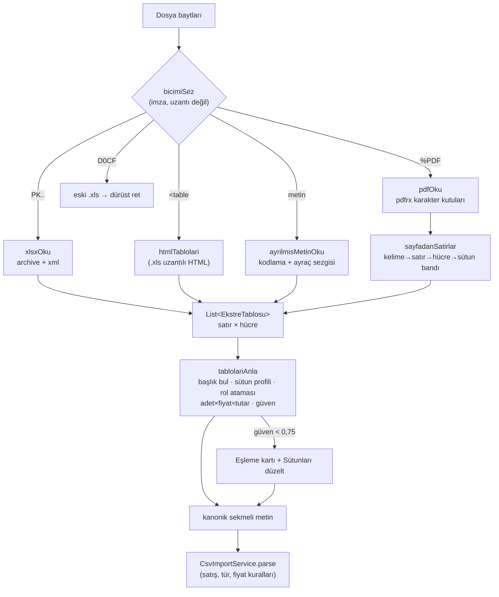

# Evrensel ekstre motoru — tasarım (2026-10-01)

**Karar sahibi:** kullanıcı — "Varlık ekstresi nasıl universal olarak eklenebilir;
öyle bir algoritma çözmeliyiz ki tüm formattakiler .pdf, .xlsx, .csv hepsini çözüp
uygulamaya dahil edebilmeli, farklı kolon yapıları veri tutma yapıları olmasına
rağmen. Bu çok kritik; müşterinin ilk gelişini hızlandıracak."

Önceki durum ve kurum araştırması: `KURUM_EKSTRESI_YAPILABILIRLIK_2026_09.md`
(yalnız yapıştırma vardı; dosya okuma, PDF ve kurum örneği yoktu).

## Gereksinimler

| İşlevsel | İşlevsel olmayan |
|---|---|
| PDF, `.xlsx`, `.xls` (HTML ya da eski ikili), CSV/TSV/TXT dosyasını telefondan seç | Kurum başına kod YOK — yeni kurum çoğu zaman sıfır iş |
| Sütun adı/sırası bilinmeyen tablodan sembol, adet, maliyet, tutar, tarih, alış/satış çıkar | Uydurma yok: emin olunmayan eşleme kullanıcıya sorulur |
| Portföy dökümü (anlık) ve işlem ekstresi (hareket) ikisi de | Cihazda çalışır; belge sunucuya gitmez (KVKK: finansal belge) |
| Temettü/virman/toplam satırları, tekrar eden sayfa başlıkları elenir | Mevcut satış/tür/fiyat kuralları tek yerde kalır (`CsvImportService`) |

## Mimari

Kod: `lib/services/ekstre/` — `tablo_okuyucular.dart`, `metin_cozucu.dart`,
`pdf_tablo.dart` (saf geometri), `pdf_okuyucu.dart` (tek eklenti noktası),
`tablo_anlama.dart`, `ekstre_ice_aktarma.dart` (giriş). Ekran:
`lib/screens/csv_import_screen.dart`. Testler: `test/ekstre_motoru_test.dart`.

## Algoritma — "anlama" katmanı

1. **Başlık satırı:** ilk 40 satırda, sözlükle ≥0,6 eşleşen FARKLI rol sayısı en
   yüksek satır (en az biri sembol/adet/fiyat/tutar). Kurum unvanı, müşteri no,
   dönem satırları üstte kalabilir. Bulunamazsa tablo başlıksız sayılır.
2. **Veri satırları:** tek hücreli satırlar (başlık/dipnot), başlığın tekrarı (PDF'in
   her sayfası) ve "Toplam / Genel Toplam" satırları atlanır.
3. **Sütun profili** (≤400 hücre): sayı oranı, tarih oranı, sembol puanı (BIST
   listesi, TEFAS 3 harf, ISIN→kod, kripto, altın/döviz sözcükleri), alış/satış
   oranı (açıklama içinde de), para birimi, tür, tam sayı oranı. Sayı biçimi
   (1.234,56 / 1,234.56) sütunun kanıtından; kanıt yoksa TABLONUN kanıtından.
   Tarih düzeni (gg/aa / aa/gg) sütun bazında: ay 13+ olan tek hücre çevirir.
4. **Rol puanı** = 1,5 × başlık + 2 × içerik; içerik şartı sağlanmadan başlık rolü
   VEREMEZ. Olumsuz sözcükler: "Son Fiyat", "Güncel", "Piyasa Değeri" maliyet/tutar
   sayılmaz (portföy dökümünde maliyetle yan yana durur). Açgözlü atama, her sütun
   tek role.
5. **Sayısal roller başlıktan gelmezse:** üç sayısal sütun arasında `a × b ≈ t`
   (±%2) satırların ≥%60'ında tutuyorsa t tutar; a/b'den tam sayı oranı yüksek
   olan adet. Başlıksız tablolar böyle çözülür.
6. **Güven:** sembol/adet başlıktan değil içerikten geldiyse düşer; adet×fiyat
   tutarla uyuşmazsa ("fiyat" belki güncel fiyattır) düşer. < 0,75 → kart uyarır,
   "Sütunları düzelt" her rol için sütun seçtirir (örnek değerle).

Kanonik çıktı: `sembol adet fiyat tutar tarih "islem turu" tur "para birimi" isim`,
sayı "1234,56", tarih "gg.aa.yyyy", yön "Alış/Satış", eksi adet → satış. Yön
sütunu varken alım/satım olmayan satır (temettü, virman, bedelsiz) çıkmaz, sayısı
kartta yazar.

## PDF

PDF'te tablo yok; karakter kutuları var. `sayfalardanTablolar`: karakter → kelime
(boşluk karakteri; ya da yatay boşluk > 0,8 × kelime yüksekliği; ya da karakter
kelimenin dikey bandının dışında) → satır (dikey merkez, 0,5 × medyan yükseklik) →
hücre (boşluk > 0,9 × yükseklik) → **blok** (medyan satır aralığının 1,8 katından
büyük dikey boşluk) → **tablo** (sayfanın ilk tablo bloğu önceki sayfadaki bir
tabloya birebir sütun uyumluysa ona katılır) → **sütun bandı** (tablonun çok hücreli
satırlarının x aralıkları birleştirilir; her hücre en çok örtüştüğü banda). Boş hücre
boş kalır, sütun kaymaz. Rakamsız, üst satırdan az dolu ve yakın satır üst satıra
eklenir (iki satıra taşan fon adı / başlık). Sınır: taranmış (görüntü) PDF metin
içermez → dürüst mesaj; OCR yok.

**Sıkı glif kutusu (2026-10-02 düzeltmesi).** PDFium `FPDFText_GetCharBox` glifin
kendi kutusunu verir: virgül rakamın üçte biri boyda ve aşağıda, nokta 1 pt, dar
"1"in sağında geniş boşluk. İlk sürüm eşikleri karakterin kendi yüksekliğiyle
ölçtüğü için iOS'ta "4.250,00" → "4 .250 ,00" okundu (sentetik test her karaktere
aynı kutuyu verdiğinden görmedi). Ölçek artık kelimenin en yüksek kutusu, dikey bağ
bant içinde olmak. Regresyon fikstürü `test/fixtures/ekstre_pdf_kutulari.json`:
gerçek PDFium çıktısı (fpdf2 + Arial ile üretilip pypdfium2 ile aynı çağrılarla
dökülmüş). Yeni bir PDF tuzağı görülürse aynı yolla fikstür ekle. Ayrıca pdfrx
`fullText`'i UTF-16 birimiyle, kutuları karakter başına verir; okuyucu rune ile
hizalar (BMP dışı karakterden sonra kayma olmasın).

## Kararlar (ADR özeti)

| Karar | Seçilen | Alternatif | Neden |
|---|---|---|---|
| Dosya seçici | `file_selector` (flutter.dev) | `file_picker` | iOS'ta yalnız belge seçici; fotoğraf izni/uyarı riski yok |
| PDF metni | `pdfrx` (PDFium, MIT) | Syncfusion PDF; platform kanalları | Android'in `PdfRenderer`'ı metin çıkarmaz; Syncfusion lisans kısıtlı; pdfrx iki platformda aynı motor. Maliyet: uygulama boyutu +PDFium ikilisi |
| XLSX | `archive` + `xml` (zaten dolaylı bağımlılık) | `excel` paketi | Yalnız okuma gerekiyor; stil/tarih biçimini kendimiz çözüyoruz |
| Eski ikili `.xls` | Dürüst ret + "xlsx/CSV olarak kaydet" | BIFF8 okuyucu yazmak | Güvenilir saf Dart okuyucu yok; yarım okuma yanlış maliyet üretir |
| Belge nerede işlenir | Cihazda | Sunucu/LLM | Finansal belge dışarı çıkmaz (KVKK); çevrimdışı çalışır |
| Anlama → mevcut ayrıştırıcı | Kanonik metin | Ayrıştırıcıyı yeniden yazmak | Satış/tür/fiyat kuralları ve testleri tek yerde kalır; kullanıcı okunanı metin olarak görür/düzeltir |

## Gerçek dosya öncesi sertleştirme (2026-10-02)

Kurum dosyası görülmeden, bilinen kurum biçimlerinden (MKK e-Yatırımcı, banka
PDF'leri, "Excel'e aktar" HTML'leri) türetilen kırılma noktaları kapatıldı;
her biri `test/ekstre_motoru_test.dart`'ta bir vakadır:

| Kırılma | Düzeltme |
|---|---|
| "THYAO TÜRK HAVA YOLLARI A.O." tek hücrede, " - " yok → sembol tanınmaz, tablo reddedilir | `sembolAyikla`: ilk kelime bilinen BIST kodu / ISIN / döviz kodu ise kesin; 3–6 harf kod + ≥2 kelimelik ad ise ilk kelime; altın deyimleri bölünmez |
| "Birim Pay Fiyatı", "İşlem Adedi", "Kıymet Kodu" sözlükte çekimli yok | Başlık ve sözlük iyelik ekinden köke iner (`_kokler`) |
| Döküm'de adet × Son Fiyat ≈ Piyasa Değeri yakalanıp "tutar" sayılıyor, ardından "maliyet uyuşmuyor" sahte uyarısı | Çarpım araması başlıktan bilinen adet/fiyatı içermek zorunda |
| `20260903` bitişik tarih, `−250` Unicode eksi | `tarihCoz` / `sayiCoz` |
| HTML'in ilk 4 KB'si `<style>` → CSV sanılır; `</td>`/`</tr>` yazmayan eski çıktı → sıfır satır | 64 KB sezgi; açılış etiketine göre bölen toleranslı ayrıştırıcı |
| `<x:row>` önekli XLSX → "dolu sayfa yok" | `namespaceUri: '*'` |
| Çok sayfalı PDF'te sayfa başına bant → sütunlar sayfadan sayfaya kayar | Bantlar belge genelinde (`sayfalardanSatirlar`) — 2026-10-03'te TABLO geneline daraltıldı: belge geneli bant, sayfasında birden çok tablo olan banka ekstresini 2 sütuna çökertti |
| Sembol tanınmayınca doğrudan hata, kullanıcı için çıkmaz | En büyük tablo güven 0 ile döner; "Sütunları düzelt" açık, metin alanı boş |

## Banka varlık ekstresi (2026-10-03)

İlk gerçek kurum örneği: DenizBank "Varlık Ekstresi" PDF'i (7 sayfa: özet, Vadesiz /
Vadeli / Yatırım Fonları tabloları, hesap hareketleri). Kullanıcı kararı: *"Sadece
yatırım ve vadeli mevduatlar içeride olmalı."*

- **Fonlar kodsuz, adla** ("YAPI KREDİ PORTFÖY YABANCI TEKNOLOJİ SEKTÖRÜ HİSSE" — TEFAS
  unvanının kesiği). `tabloyuAnla` sembol sütunu bulamayıp ad sütunu ("Yatırım Fonu
  İsmi") ve adet bulursa tabloyu **adla tanımlı** işaretler. Kod, `fon_adi.dart`
  `fonKoduBul` ile TEFAS unvanından çıkar: ad, unvanın kelime kelime öneki olmalı;
  **tek aday → kod, aksi hâlde satır alınmaz** ve önizleme "Fon tanınmadı" der.
  Tahmin yok: çözülmeyen "GARANTİ PORTFÖY ALTIN…" tür çıkarımında gram altın olurdu.
  Liste `TefasService.fetchAllFunds` (önbellekli); alınamazsa tek satır uyarı.
- **"Pay Adedi" ve "Bakiye"** ikisi de adet sözlüğünde tam eşleşir; rol adayları
  eşit puanda artık SOLDAKİ sütunu seçer (`List.sort` kararlı değildi).
- **Tarih sütunu yok:** satırlar bugünü değil belgenin "31/05/2026 tarihi itibariyle"
  gününü alır (`belgeTarihiBul`; yoksa "Dönemi … - …" sonu). Maliyet = o günkü birim
  fiyat; eşleme kartı bunu söyler (K/Z o günden başlar). Alış maliyeti bu belgede yok.
- **Vadeli mevduat** (`mevduat_tablosu.dart`): başlıkta vade sonu + faiz + bakiye olan
  tablo; satır başına başlangıç, vade sonu, brüt faiz, anapara. Sepete
  `BulkCartItem.mevduat` sözleşmesiyle girer, toplu kayıt `SozlesmeNotifier.mevduatAc`
  ile yazar (sözleşme + dönem + lot). Stopaj `onerilenStopaj`. Yalnız TL; eksik
  alanlı satır alınmaz. CSV yolu sözleşmeli türü hâlâ reddeder — mevduat metne girmez.
- **Vadesiz hesap alınmaz** (harcama hesabı, yatırım değil); başlığında vade sonu
  olmadığı için mevduat okuyucusu onu zaten görmez.
- **Kurum** belgede en çok geçen banka adı (`bankaAdiBul`); fon adındaki başka banka
  ("YAPI KREDİ PORTFÖY") yanıltmaz.
- **Okunmayan:** hesap hareketleri (fon alım/satımları açıklama metninde:
  "TEFAS Müşteriye Fon Satış YAY 29,00x1.739,18"). ⚠️ Tuzak: banka gözünden yazılır,
  **"Müşteriye Fon Satış" müşterinin ALIŞI**, "Müşteriden Fon Alış" SATIŞI. Hareketler
  okunacaksa yön bu kuralla çevrilmeli. Yalnız tutar veren "Varlık Geçmişi Formu"
  (adet yok) desteklenmiyor — elle eşleme yedeğine düşer; adet = tutar ÷ o günün
  fiyatı ile eklenebilir.

| Karar | Seçilen | Alternatif | Neden |
|---|---|---|---|
| Kodsuz fon | TEFAS unvanı kelime öneki, tek aday | Bulanık benzerlik; ISIN tablosu | Yanlış fon eklemek eklememekten kötü; ISIN→kod açık kaynağı yok (DLY'nin ISIN'i kodu içeriyor, YAY'ınki içermiyor) |
| Vadeli mevduat | Sepette sözleşmeyle, kayıt `mevduatAc` | CSV satırı | Lot sözleşmesiz anlamsız; form ile aynı yazım yolu |

## Hesap hareketleri ve tanılama (2026-10-05)

Kullanıcı (yasin) kendi banka varlık ekstresini yükledi: "hata vermiyor ama varlıkları
ayıklayamıyor", ardından "hangi banka olduğu önemli değil, tüm banka ve aracı kurumları
kapsamalıyız" ve "bunun içinden varlık alım satımları nasıl ayıklarsın".

- **Sessiz arıza:** `TefasService.fetchAllFunds` ağ hatasını yutup BOŞ liste döner. Boş
  listeyle adla yazılmış her fon "tanınmadı" olur ve kullanıcı nedenini görmez. Ekran artık
  boş listeyi "fon listesi alınamadı" sayar (`csv_import_screen.dart` `_fonAdlariniCoz`).
- **Fon unvanı sembol sayılıyordu:** "GARANTİ PORTFÖY ALTIN…" altın deyiminden 0,9,
  "YAPI KREDİ PORTFÖY…" ilk kelimesinden 0,7 alıyordu; üç fonluk tabloda ad sütununun sembol
  oranı 0,5'i aştı, `isim` rolü düştü, tablo anlaşılmadı. "PORTFÖY" geçen hücre artık sembol
  puanı almaz (`sembolPuani`).
- **Hareketlerden gerçek alış** (`hareket_tablosu.dart`, bayrak `ekstre_hareketleri`):
  başlığında "Açıklama" ve "Tarih" olan tablolarda `KOD adet x fiyat` kalıbı aranır; adet ×
  fiyat ≈ |tutar| (±%2) tutmazsa alınmaz (stopaj satırı kalıbı taşır, tutarı tutmaz). **Yön
  paranın işaretinden:** hesaptan çıkan para (eksi ya da Çekilen/Borç sütunu) alış, giren
  satış — banka gözünden yazılmış kelimeler ("Müşteriye Fon Satış") kurumdan kuruma değişir,
  işaret değişmez. Hareket tek başına içe aktarılmaz; yalnız varlık tablosunda aynı kodla
  duran satırı inceltir: dönemdeki alışlar eldekini aşmıyorsa alışlar gerçek tarih/fiyatla
  ayrı satır olur, kalan adet ekstre gününde kalır. Satışlı ya da alışı eldekini aşan kod
  dokunulmaz (sıra tahmini yok). Bankanın iç süpürme fonu ("FON5", KAPTAN) varlık tablosunda
  olmadığı için hiçbir yere girmez.
- **Tanılama iskeleti** (`ekstre_iskeleti.dart`, bayrak `ekstre_tanilama`): motor dosyayı
  tam anlamadığında kartta "Tanılama metnini kopyala". Ham tablolar (PDF geometrisinin
  böldüğü hâli) + motorun kararı; başlık sözlüğü ve genel finans kelimeleri dışında her
  kelime maskelenir (harf A/a, rakam 9, noktalama ve uzunluk korunur). Belge cihazdan
  çıkmaz; kullanıcı metni kendisi gönderir. Sonraki adım (yasin kararı): bu iskelet, motor
  emin olmadığında sunucu üzerinden Claude'a gidip sütun eşlemesi alınacak (Gizlilik 1.6).

## Riskler ve açık işler

- **Gerçek kurum örneği: yalnız DenizBank** (PDF, 2026-10-03; kişisel veri olduğu için
  fikstür olarak repoda DEĞİL — düzeni `test/banka_ekstresi_test.dart` sentetik
  değerlerle taklit eder). Aracı kurum (MKK, Midas…) örneği hâlâ yok.
- **iOS derlemesi:** pdfrx/file_selector yerel parçaları bu makinede derlenmedi (CI).
- **Uygulama boyutu:** PDFium ikilisi — ölçüldü (`docs/CPU_GPU_VE_BOYUT_RAPORU_2026_10.md`):
  arm64 APK'da 6,4 MB, Play indirmesinde 3,0 MB. Kalması kararlaştırıldı.
- **Çok satırlı hücre (PDF):** 2026-10-03'ten beri taşan satır (rakamsız, üstten az dolu,
  satır aralığı kadar yakın) üst satıra eklenir. Rakamlı devam satırı (işlem açıklamasının
  "SN: 5752…" devamı) bilinçli olarak eklenmez; o satır ayrı kalır.
- **Sayfalar arası tablo birleştirme** yalnız birebir sütun uyumunda: DenizBank hareket
  listesi sayfa 3 ve 4'te ayrı tablo kalıyor (içe aktarılmadığı için etkisiz).
- **Sonraki adım (E):** "ekstrem tanınmadı → örnek gönder" akışı (açık rızayla).
